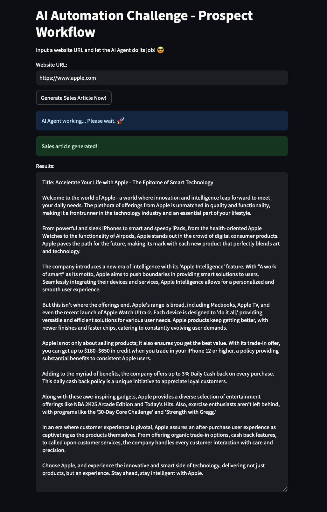

# AI Automation Challenge - Prospect Workflow

   

# About 

This project uses Python and AI tools to automate prospect company research for sales teams. It features a workflow where users input a company’s website, and the system generates a concise, informative article for the sales team. The implementation integrates Streamlit for a user-friendly experience, BeautifulSoup for web scraping, and GPT-4 for Generative AI content creation. The data extracted from the websites is saved in JSON format to ensure a structured and reusable data pipeline.

Although simple, this solution reduces manual effort, improves efficiency, and delivers actionable insights with minimal input by automating the research process.

# Installation and Setup

1. Clone this repository:
```
git clone https://github.com/luuisotorres/AI-Automation-Challenge-Prospect-Workflow.git
cd AI-Automation-Challenge-Prospect-Workflow
```

2. Install dependencies:
```
pip install -r requirements.txt
```

3. Copy the `.env.example` file to a new file named `.env`:
```
cp .env.example .env
```
Open the `.env` file and replace `your_openai_api_key_here` with your OpenAI API key.

4. Run the Streamlit app:
```
streamlit run app.py
```

5. Enter a website URL to get the article! 

<p align="left">
  
</p>

# Project Structure

```
.
├── .env                    # Environment variables (API keys)
├── .env.example            # Example environment file
├── README.md               # Project documentation
├── app.py                  # Main Streamlit application
├── images/                 # Screenshots and images
│   └── Apple.png           # Example output screenshot
├── requirements.txt        # Project dependencies
├── scrape_website.py       # Web scraping script
├── gpt_utils.py            # AI Agent script
├── scraped_data.json       # Temporary storage for scraped data
└── sales_article.txt       # Generated sales article output
```

The project consists of several key components:
- Web scraping module to extract data from company websites
- Integration with OpenAI's GPT for article generation
- Streamlit interface for user interaction
- JSON data storage for structured information
- Environment configuration for secure API key management

---
**Luis Fernando Torres, 2025**

Let's connect! 🔗  
[LinkedIn](https://www.linkedin.com/in/luuisotorres/) • [Medium](https://medium.com/@luuisotorres) • [Kaggle](https://www.kaggle.com/lusfernandotorres/code)  

[https://luuisotorres.github.io/](https://luuisotorres.github.io/)